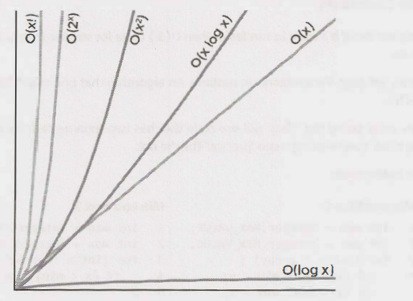

# Big O Notation Summary

## Introduction to Big O Notation

- **Purpose**: Big O notation helps in understanding the performance and scalability of algorithms by describing how their run time or space requirements grow as the input size increases.
- **Focus**: It focuses on the worst-case scenario to ensure the algorithm performs efficiently even in the most challenging situations.

## Basic Concepts

- **Time Complexity**: Measures how the run time of an algorithm increases as the size of the input increases.
- **Space Complexity**: Measures how the memory usage of an algorithm grows with the input size.

## Common Big O Notations

- **O(1)**: Constant time. The run time does not change with the size of the input.
- **O(log N)**: Logarithmic time. The run time grows logarithmically with the input size.
- **O(N)**: Linear time. The run time grows linearly with the input size.
- **O(N log N)**: Linearithmic time. Common in efficient sorting algorithms like mergesort and heapsort.
- **O(N^2)**: Quadratic time. The run time grows quadratically with the input size, common in algorithms with nested loops.
- **O(2^N)**: Exponential time. The run time doubles with each additional element in the input, often seen in recursive algorithms with multiple calls.
- **O(N!)**: Factorial time. The run time grows factorially, seen in algorithms that generate permutations of the input.

    

## Analyzing Complexity

- **Drop Constants**: In Big O notation, constants are dropped to focus on the growth rate. For example, O(2N) simplifies to O(N).
- **Drop Non-Dominant Terms**: Only the term with the highest growth rate is kept. For example, O(N + N^2) simplifies to O(N^2).

## Space Complexity

- **Auxiliary Space**: The temporary or extra space used by the algorithm.
- **In-Place Algorithm**: An algorithm that uses a constant amount of space, usually O(1).

## Examples and Applications

- **Array and Linked List Operations**: Different operations (insert, delete, access) have varying time complexities.
- **Recursive Algorithms**: Analysis often involves solving recurrence relations.
- **Sorting Algorithms**: Different sorting algorithms have different time complexities (e.g., O(N log N) for mergesort, O(N^2) for bubblesort).
- **Searching Algorithms**: Binary search operates in O(log N) time on a sorted array.

## Practical Tips

- **Know the Common Complexities**: Familiarize yourself with the time and space complexities of common data structures and algorithms.
- **Optimize for the Expected Case**: While Big O focuses on the worst-case, understanding the expected case can help in practical scenarios.
- **Balance Time and Space**: Sometimes, an algorithm can be optimized for speed at the cost of using more memory, and vice versa.

## Conclusion

Understanding Big O notation is crucial for evaluating the efficiency of algorithms and making informed decisions during coding interviews and software development. It helps in comparing different approaches and choosing the most suitable one based on the problem constraints and requirements.

By mastering these concepts, you'll be better prepared to analyze and optimize the performance of your code, which is a critical skill in both interviews and real-world programming.
