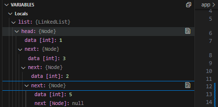
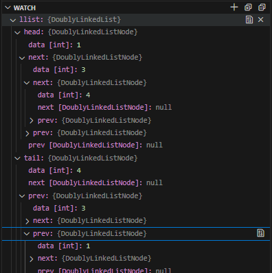

## Linked Lists

### Definition
-  Linear ata structure where each element (node) is a separate obj
-  Each node contains twp parts
    - Data 
    - Reference (link) to the next node



### Types
- Singly Linked List
    * Each Node points to the next node in sequence
- Doubly Linked List
    * Each node has pointers to both the next and previous nodes, allowing traversal in both directions
    
- Circular Linked List
    * The last node points back to the first node, forming a circle

### Advantages
- Dynamic Size
    * Linked lists can grow or shrink in size dynamically since nodes are allocated dynamically
- Ease of Insertion/Deletion
    * Insertions and Deletions are efficient O(1) time complexity as they involve adjusting pointers unlike arrays, which require shifting elements

### Basic Operations
1. Traversal: 
    - Iterating through the list from the head to the last node
    ```cs
    public void PrintList(){
        Node current = head;
        while(current != null){
            Console.WriteLine(current.data + " ");
            current = current.next;
        }
        Console.WriteLine();
    }
    ```
2. Insertion:
    - At the Beginning
    - At the End
    - In the Middle
    ```cs
        // Insert at the beginning of the linked list
    public void InsertAtBeginning(int value){
        Node newNode = new Node(value);
        newNode.next = head;
        head = newNode;
    }


    // Insert at the end of the linked list
    public void InsertAtEnd(int value){
        Node newNode = new Node(value);
        if(head == null){
            head = newNode;
            // Don't set the new node's next, because this should always be null at the end
            return;
        }

        Node current = head; // set to the beginning for traversal
        while(current.next != null){ // go to the last node
            current = current.next;
        }

        //attach node to the linked list at the end.
        current.next = newNode;
    }


    // Insertion after a specific node (middle)
    public void InsertAfterNode(Node prevNode, int value){
        if(prevNode == null)
        {
            Console.WriteLine("Previous node cannot be null");
            return;
        }

        // adjust the next and prev of this current node.
        Node newNode = new Node(value);
        newNode.next = prevNode.next;
        prevNode.next = newNode;
    }
    ```
3. Deletion:
    - Adjust pointers to skip over the node to be deleted and deallocate its memory
    ```cs    
    public void DeleteNode(int value){
        Node? current = head;
        Node? prev = null;


        // if it's the first value - just make the new head the next one
        if(current != null && current.data == value){
            head = current.next;
        }


        while(current != null && current.data != value){
            prev = current;
            current = current.next;
        }

        if(current == null){
            Console.WriteLine("Value not found in the list");
        }
        // adjust the pointers of the prev to skip the current 
        prev.next = current.next;
    }
    ```
4. Search
    - Traverse the list to find a specific node based on its data value
    ```cs
        public bool Search(int value){
        Node current = head;
        while(current != null){
            if(current.data == value){
                return true;
            }
            current = current.next;
        }
        return false;
    }
    ```

### Key Considerations
* Null Pointer - last node in linked list points to `null` indicating the end of the list
* Head Pointer - A reference to the first node `head` allows access to the entire list

### Summary 
* Linked Lists are fundamental data structures characterized by their dynamic size, efficient insertion/deletion operations, and various types catering to different needs (singly, doubly, circular)